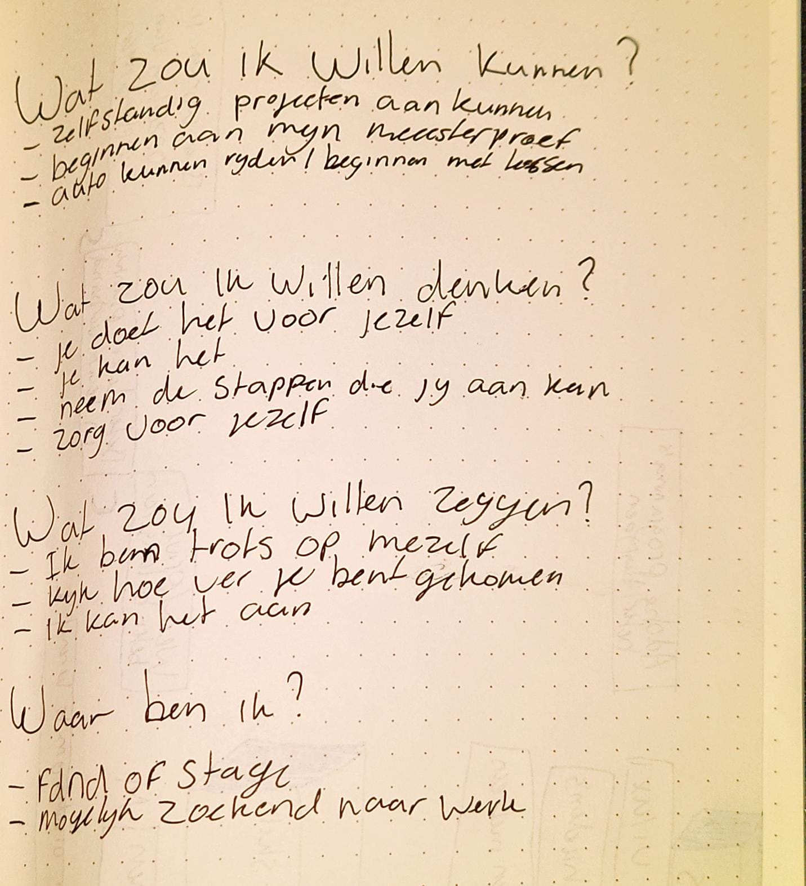
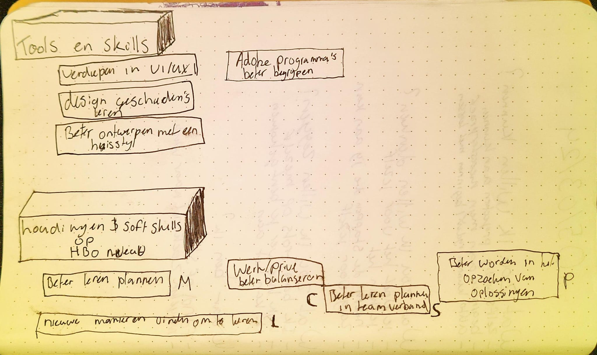
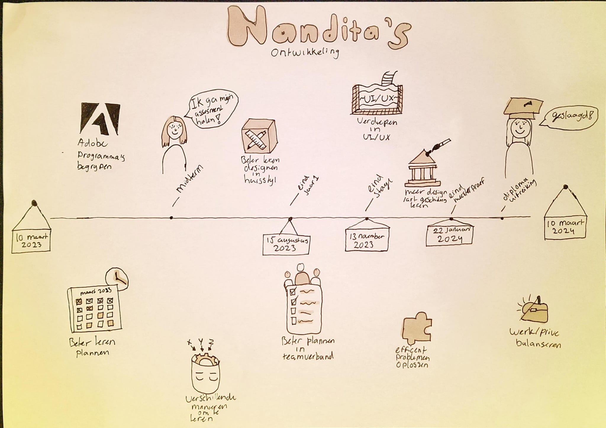

> _Fork_ deze deeltaak en ga aan de slag. 
Onderstaande outline ga je gedurende deze taak in jouw eigen GitHub omgeving uitwerken. 
De instructie vind je in: [docs/INSTRUCTIONS.md](docs/INSTRUCTIONS.md)

# Schets je ontwikkeling

Ik ben eerst begonnen met het invullen van de "wat zou ik" vragen:

Om mijn ontwikkelings praatplaat netjes te houden heb ik de tools, skills, soft skills en houdingen opgeschreven op papier

Dit is mijn ontwikkelings praatplaat

## Licentie

This work is licensed under [GNU GPLv3](./LICENSE).
